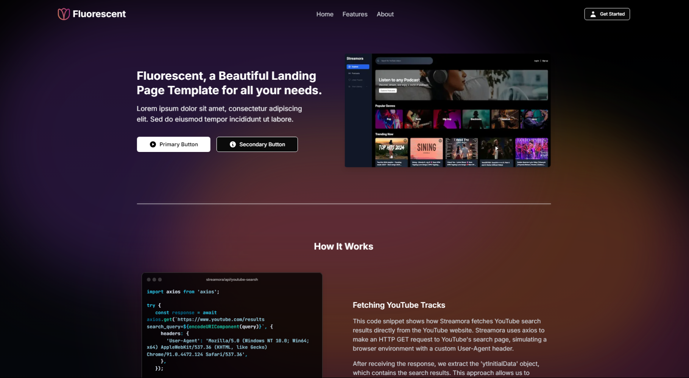

#  Fluorescent Website Template
Created by [@t-a-g-o](https://github.com/t-a-g-o)
> Fluorescent is a beautiful landing page template featuring smooth animations, gradient backgrounds, and modern UI components. Built with Next.js, Tailwind CSS, and Framer Motion, it provides an engaging way to showcase your SaaS product or digital service. With its dynamic color transitions and floating shapes, Fluorescent creates an immersive experience that captures visitors' attention.
> View it live [_here_](https://streamora.tago.works).

## Table of Contents
* [Technologies Used](#technologies-used)
* [Features](#features)
* [Screenshots](#screenshots)
* [Setup](#setup)
* [License and Contact](#license-and-contact)

## Technologies Used


## Features
- **Responsive Design:** Looks great on desktop, tablet, and mobile devices
- **Project Showcase:** Dedicated sections to highlight your best work
- **Statistic and Features:** Display your key features and statistics
- **Team Section:** Introduce yourself or your team members
- **Customizable:** Easy to modify and adapt to your personal brand


## Screenshots



## Setup
1. Clone the repository
    ```sh
    git clone https://github.com/t-a-g-o/fluorescent.git
    ```

2. Go into the fluorescent directory
    ```sh
    cd fluorescent
    ```

3. Install requirements
    ```sh
    npm install -r
    ```

4. Run the live dev preview
    ```sh
    npm run dev
    ```
To make a favicon show in the browser, add an icon image to `src/app/`. It has to be "ico" format and it has to be named "favicon.ico".  Make the icon 256x256 if possible, this is the most visible and detailed icon in the browser.

## License and Contact
This project is published under the [MIT License](./LICENSE)

If you are interested in working together, or want to get in contact with me please email me at santiago@tago.works
